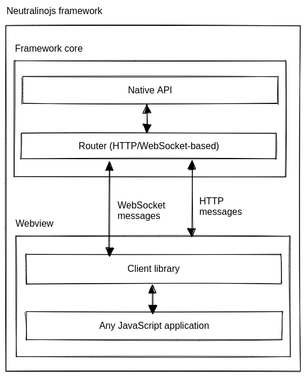

The Neutralinojs framework core follows a single-process, monolithic, and layered architectural pattern
with two-interconnected components: the framework core (C++) and the client library (JavaScript).
Look at the following high-level architectural diagram:

The framework core has two key components: the router and the native API. The router component is responsible
for processing HTTP and WebSocket messages. Neutralinojs typically serve all web resources via HTTP like a
normal HTTP web server. The Neutralinojs native API communication protocol uses the WebSocket messaging
protocol.

The router serves web resources and executes native API functions according to the incoming requests
from the web context.

Your JavaScript application needs to use the Neutralinojs client library functions to execute native API
operations. The platform-specific webview runs the JavaScript code of the client library and your application.
The webview component isn't a core framework component, so you can run Neutralinojs applications on any modern
web browser with browser, chrome, and cloud modes.

Because of this flexibility, you can write extensions with any programming language and connect to the
framework core with authentication details. Even though an extension-less application follows a monolithic
pattern, extensions make Neutralinojs applications non-monolithic with the process-based microservices architecture.

